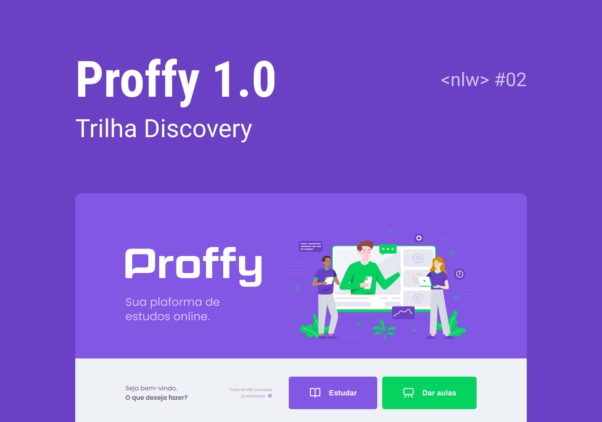

<h4 align="center">
    
    <br/>
    Proffy 1.0 - seu marketplace para aulas
    <br>
</h4>

<p align="center">
  Next Level Week 2.0 🚀
  <br>
  🚧 Projeto desenvolvido durante a NLW#2 (Ago/2020)... 🚧
  <br>
  <br>
    
  

  
	
  <a href="https://www.linkedin.com/in/cicerocruz/">
    
  </a>

  <a href="https://github.com/cicerocruz/SemanaOmnistack11/commits/master">
    
  </a>

  <a href="https://github.com/cicerocruz/SemanaOmnistack11/issues">
    
  </a>

  
</p>

# Índice
- [Sobre](#sobre)
- [Tecnologias Utilizadas](#tecnologias)
- [Como Contribuir](#como-contribuir)
- [Quem Ministrou](#quem-ministrou)
- [Licença](#licença)
- [Contatos](#contatos)

<a id="sobre"></a>
# :mag: Sobre o projeto
Ajudamos professores a darem aulas e aos alunos deterem aulas dos professores com a melhores aptidão que lhe atende :microscope:  
Desenvolvido durante a 2° versão da Next Level Week, oferecida pela [Rocketseat :rocket:][url-rocketseat] :coffee:  
O NLW detêm muito conteúdo prático, desafios e hacks onde o conteúdo fica disponível durante uma semana.
A criação do projeto veio com a homenagem aos nossos professores, já que a data chegou próximo com a **dia dos professores** :school:

## :art: O protótipo?
O layout da aplicação em sua versão **web** está disponível no [Figma][url-figma]   

O layout da aplicação em sua versão **mobile** está disponível no [Figma][url-figma-mobile]   


<a id="tecnologias"></a>
# :hammer: Tecnologias?
O projeto utiliza as seguintes ferramentas:
* [TypeScript][url-ts]
* [NodeJS][url-node]
* [React][url-react]
* [Expo][url-expo]
* [React Native][url-react-native]

## :electric_plug: Como usar?
> :bulb: A versão web e mobile depende que o server esteja sendo executado para seu funcionamento.

Considerando que o projeto foi divido em três partes:
  1. Back End (server)
  2. Front End (web)
  3. Mobile (mobile)


## :hand: Pré-requisitos
É **necessário** que tenha instalado em sua máquina:
* [Git][url-git]
* [Noje.js][url-node]
* Um gerenciador de pacotes como [NPM][url-npm] ou [Yarn][url-yarn]
* [Expo][url-expo] instalado de forma global

## :package: Como clonar a aplicação?
```bash
# Clonar o repositório
$ git clone https://github.com/cicerocruz/Proffy_V1.0
```

## :rocket: Como executar a aplicação?
```bash
# Instalar as dependências
$  npm install && expo install

## Criar a base de dados
$ cd server && npm run knex:migrate && npm run knex:seed && cd ..

# Iniciar a API
$ cd server
$ npm run dev

# Iniciar versão web
$ cd web
$ npm start

# Iniciar versão mobile
$ cd mobile
$ expo start
 
```
<a id="como-contribuir"></a>
# :coffee: Como posso ajudar?
1. Faça o Fork deste repositório
2. Comece uma branch com sua feature 
```bash 
$ git checkout -b minha-feature
```
3. Confirme (Commit) seus feitos
```bash 
$ git commit -m 'Minha nova feature'
```
4. Suba (push) sua branch
```bash 
$ git push origin minha-feature
```

<a id="quem-ministrou"></a>
# :mortar_board: Quem ministrou ?
As aulas foram ministradas pelo [Diego Fernandes][diego], nas aulas do **Next Level Week 2.0 - OmniStack** :rocket:

<a id="licença"></a>
# :page_with_curl: Licença
O projeto está utilizando a licença MIT. Confira [LICENSE][license] para mais detalhes.  

---

<a id="contatos"></a>
# :iphone: Contatos

Me acompanhe nas minhas redes sociais.

<p align="center">

   <a href="https://github.com/cicerocruz" target="_blank" >
    </a> 
    
 <a href="https://twitter.com/cicero_cruz" target="_blank" > 
     </a> 
  
  <a href="https://www.instagram.com/cicero_cruz/" target="_blank" >
    </a> 
  
  <a href="https://www.facebook.com/ciceroodilio.cruz.3" target="_blank" >
    </a> 

  <a href="https://www.linkedin.com/in/cicerocruz/?locale=pt_BR" target="_blank" >
    </a> 
  
  <a href="mailto:cicero.cruz@gmail.com" target="_blank" >
    </a> 
  
  <a href="https://api.whatsapp.com/send?phone=5511961962967" target="_blank" >
    </a>
</p>

---

<h4 align="center">
    Feito com ❤️ by <a href="https://www.linkedin.com/in/cicerocruz/?locale=pt_BR" target="_blank">Cícero Cruz</a>
</h4>
 
[url-figma]: https://www.figma.com/file/EJ22k8VWB3JwiWV2MRwtU9/Proffy-Web
[url-figma-mobile]: https://www.figma.com/file/TjfS2rrFRinksCbsw5FFAj/Proffy-Mobile
[url-ts]: https://www.typescriptlang.org/
[url-node]: https://nodejs.org/pt-br/
[url-react]: https://reactjs.org/
[url-react-native]: https://reactnative.dev/
[url-expo]: https://expo.io/
[url-rocketseat]: https://rocketseat.com.br/
[url-git]: https://git-scm.com/
[url-vs]: https://code.visualstudio.com/
[url-npm]: https://www.npmjs.com/
[url-yarn]: https://yarnpkg.com/
[diego]: https://github.com/diego3g
[license]: https://github.com/cicerocruz/Proffy_V1.0/blob/master/LICENSE.md
